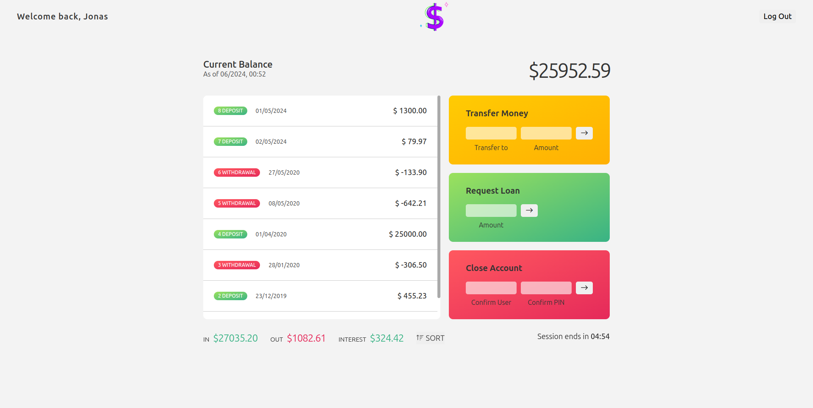

**Link:** [https://moneymingle.netlify.app/](https://moneymingle.netlify.app/)
> [!TIP]
> user1: **js** pin: **1111**  
> user2: **jd** pin: **2222**
# Money Mingle: Web Application Project
**Project Name:** Money Mingle
**Technologies Used:** HTML, CSS, JavaScript
## Project Overview
Money Mingle is a dynamic web application designed to facilitate seamless financial transactions between two user accounts. This intuitive platform offers a range of features to manage and transfer funds efficiently, ensuring users have complete control over their financial activities.  
  
Money Mingle prioritizes user experience with a clean and responsive design. The application is easy to navigate, ensuring that users can perform financial transactions with ease and confidence. Each feature is designed to be user-friendly, making Money Mingle an ideal choice for managing personal finances online.  

## Features
1. **User Authentication:**
Secure login functionality allowing users to access their personal accounts.
2. **Money Transfer:**
Effortlessly transfer money between two accounts with just a few clicks. Users can easily specify the recipient account and the amount to be transferred.
3. **Loan Facility:**
Users can apply for a loan from the bank directly through the application. The process is straightforward, providing quick access to necessary funds.
4. **Account Management:** Comprehensive account management options allow users to delete their accounts at any time. This feature ensures users have full control over their personal data and financial activities.

Money Mingle is a fun project created for educational and recreational purposes. It is not a real financial application.
